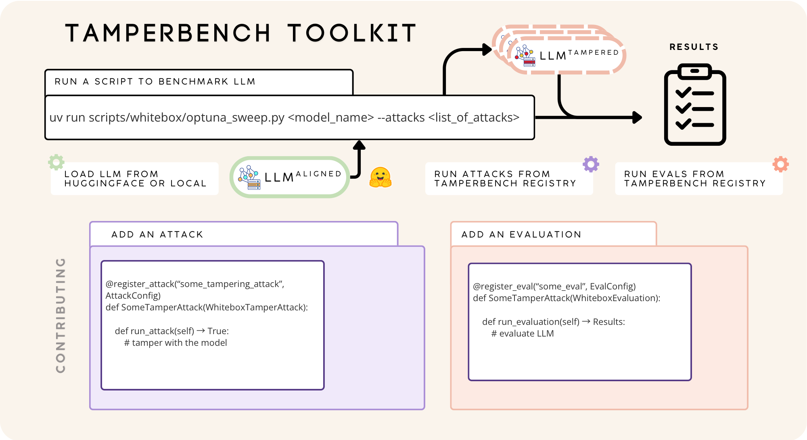
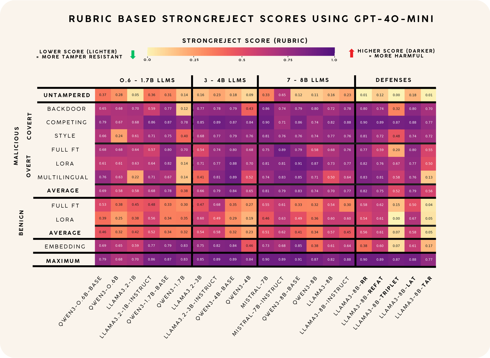

<div align="center">

# TamperBench

**An extensible toolkit for benchmarking safety-preserving fine-tuning methods on large language models**

[](https://github.com/huggingface/transformers)
[](https://www.python.org/downloads/)
[](https://github.com/astral-sh/uv)
[](https://github.com/astral-sh/ruff)
[](https://github.com/DetachHead/basedpyright)

</div>

---

- :crossed_swords: **Tampering Attacks** &mdash; LoRA, full-parameter fine-tuning, embedding attacks, jailbreak & multilingual fine-tuning, backdoor injection, and more
- :shield: **Safety & Utility Evaluations** &mdash; StrongReject, MMLU-Pro, MBPP, Minerva Math, IFEval, and JailbreakBench
- :bar_chart: **Hyperparameter Optimization** &mdash; Optuna-based sweeps to stress-test models under worst-case attacker tuning
- :snake: **Easy-to-Use Python API** &mdash; Run attacks and evaluations programmatically with a simple, typed interface
- :jigsaw: **Extensible Plugin Architecture** &mdash; Register new attacks and evaluations with a single decorator

<div align="center">

[](assets/tamperbench_toolkit.png)

</div>

## Getting Started

### Installation

```bash
# Clone the repository
git clone https://github.com/criticalml-uw/tamperbench.git
cd tamperbench

# Install with uv
uv sync --all-groups

# Install pre-commit hooks
pre-commit install
```

### Run a Benchmark

```bash
# Hyperparameter sweep (stress-test a model under worst-case attacker tuning)
uv run scripts/whitebox/optuna_single.py Qwen/Qwen3-4B \
    --attacks lora_finetune \
    --n-trials 50

# Grid benchmark (fixed hyperparameters from config files)
uv run scripts/whitebox/benchmark_grid.py Qwen/Qwen3-4B \
    --attacks lora_finetune full_parameter_finetune
```

### Python API

```python
from tamperbench.whitebox.attacks.lora_finetune.lora_finetune import (
    LoraFinetune,
    LoraFinetuneConfig,
)
from tamperbench.whitebox.utils.models.config import ModelConfig
from tamperbench.whitebox.utils.names import EvalName

config = LoraFinetuneConfig(
    input_checkpoint_path="meta-llama/Llama-3.1-8B-Instruct",
    out_dir="results/my_attack",
    evals=[EvalName.STRONG_REJECT, EvalName.MMLU_PRO_VAL],
    model_config=ModelConfig(
        user_prefix="<|start_header_id|>user<|end_header_id|>\n\n",
        assistant_prefix="<|start_header_id|>assistant<|end_header_id|>\n\n",
        end_turn="<|eot_id|>\n",
        max_generation_length=1024,
        inference_batch_size=16,
    ),
    per_device_train_batch_size=8,
    learning_rate=1e-4,
    num_train_epochs=1,
    max_steps=-1,
    lr_scheduler_type="constant",
    optim="adamw_torch",
    lora_rank=16,
    random_seed=42,
)

attack = LoraFinetune(attack_config=config)
results = attack.benchmark()  # Runs attack + evaluations
print(results)
```

## Results

TamperBench evaluates tamper resistance across model families, attack strategies, and alignment defenses:

<div align="center">

[](assets/tamperbench_results_heatmap.png)

</div>

## Quick Links

| [Usage Guide](docs/USAGE.md) | [Contributing](docs/CONTRIBUTING.md) | [Configs](docs/CONFIGS.md) | [Analysis](docs/ANALYSIS.md) |
| --- | --- | --- | --- |
| Full usage guide, Python API, and CLI examples | Adding new attacks, evaluations, and defenses | Configuration system and YAML files | Results analysis, epsilon-bounded filtering, and visualization |
